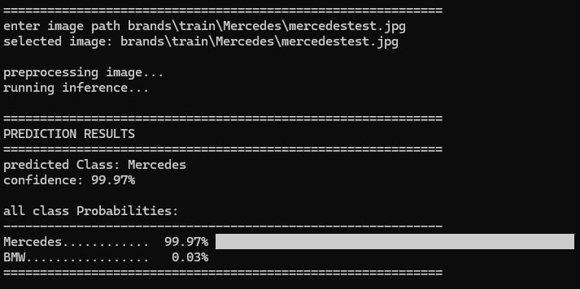
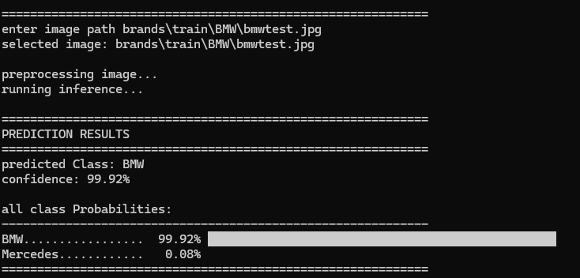

# Car Brand Classification using CNN

A custom convolutional neural network for identifying automobile brands from images.

## Project Overview

This repository contains a CNN model designed to classify car brands from photographs. The current implementation distinguishes between **Mercedes-Benz** and **BMW** vehicles with **90% accuracy**.

## Model Performance

**Training Details:**
- Dataset size: 2,500+ images
- Classes: 2 (Mercedes-Benz, BMW)
- Accuracy: 90%

## Inference Examples

### Test Case 1: Mercedes-Benz

Input image:

Model prediction:

**Result:** Correctly identified as Mercedes-Benz

### Test Case 2: BMW

Input image:

Model prediction:

**Result:** Correctly identified as BMW

## Customization

This model architecture is flexible and can be adapted for various classification tasks:

- **Multi-brand classification**: Extend beyond two classes to identify multiple car manufacturers
- **Custom datasets**: Train on your own image datasets for different classification problems
- **Transfer learning**: Use the trained weights as a starting point for related vision tasks

## Architecture

The model implements a custom CNN architecture optimized for automotive brand recognition, featuring:
- Multiple convolutional layers for feature extraction
- Pooling layers for spatial dimension reduction
- Fully connected layers for final classification

---

**Note:** The model's performance can be improved with larger datasets and additional training epochs. Feel free to experiment with different architectures and hyperparameters.
      
