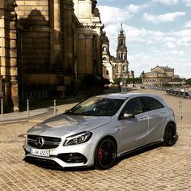
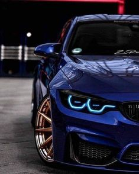

# CNN-to-classify-car-brands
I share in this repo my custom CNN to predict car brands.
to predict between two cars brands ( Mercedes or a BMW ) with a 90percent accuracy.
trained on more than 2500 images.
here's a little infrence:

as we see the model predected correct.

and again with a BMW image:

You can custom the model to predect between whatever with the roght dataset.
the data structure should be as following:
data---
--------train---
---------------class1
---------------class2
--------val---
---------------class1
---------------class2

you can use more than two classes.
               
      
